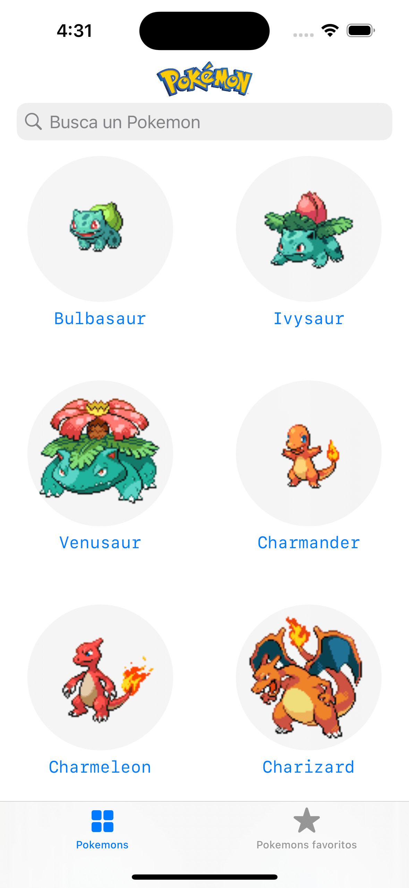
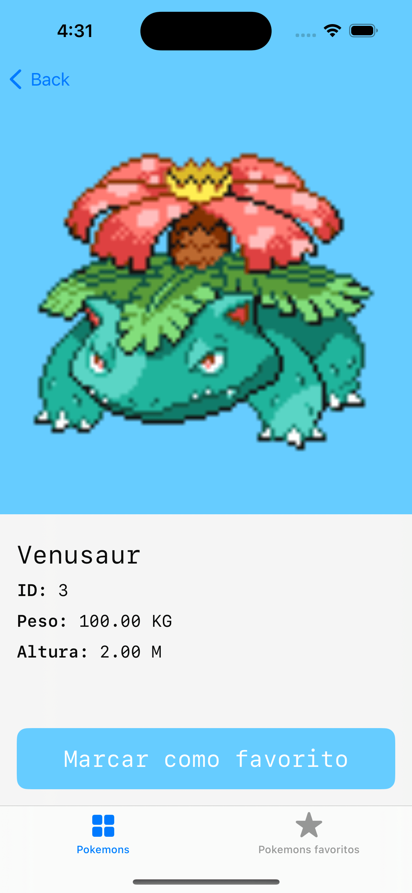

# SwiftPokemonAppDemo

## Descripción

Aplicación móvil iOS para gestionar Pokemons favoritos

## Características

- SwiftUI
- MVVM
- API: https://pokeapi.co/

## Capturas de Pantalla

## Requisitos de Instalación

- iOS 17.2+
- Xcode 15.1+
- Swift 5.0

## Instalación

1. Clona este repositorio.
2. Abre el archivo `PokemonApplication.xcodeproj` en Xcode.
3. Compila y ejecuta la aplicación en el simulador o en tu dispositivo iOS.
